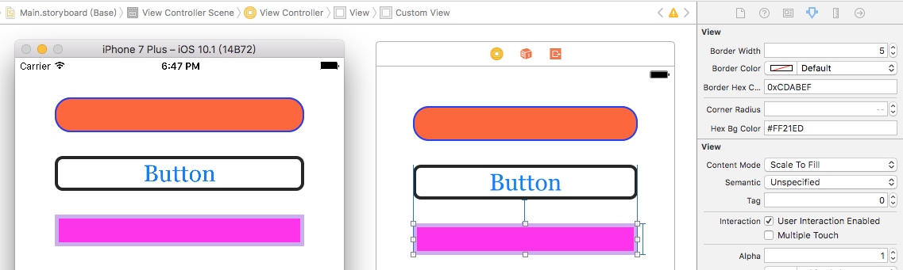

# IBInspectableDemo

#### 通过IBInspectable属性声明，配合IB_DESIGNABLE宏，实现在Xcode中所见即所得。

## 预览

## 环境

- Xcode6.0+
- iOS7.0+

## 使用

- 将Extension目录拖到你的项目即可
- 如果需要在Xib/Storyboard中实时渲染你的视图，别忘了在你的视图类声明前加上IB_DESIGNABLE宏

